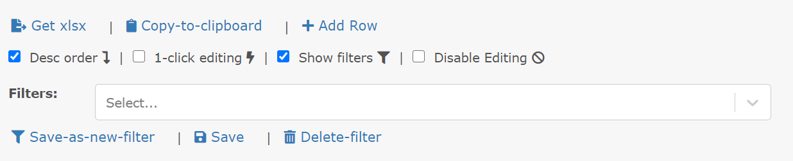
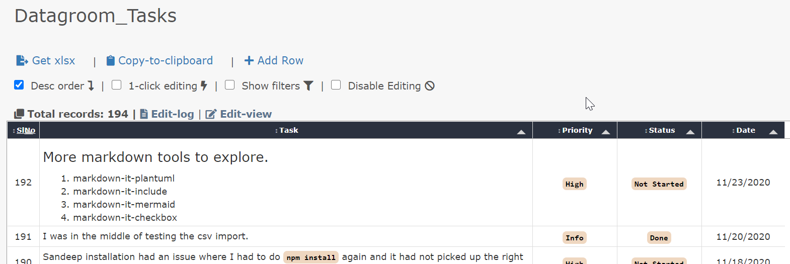
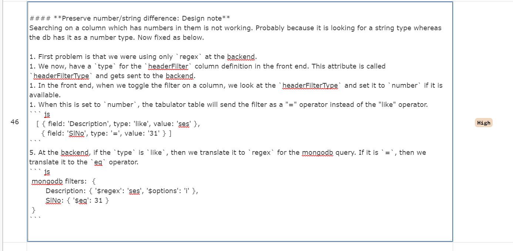
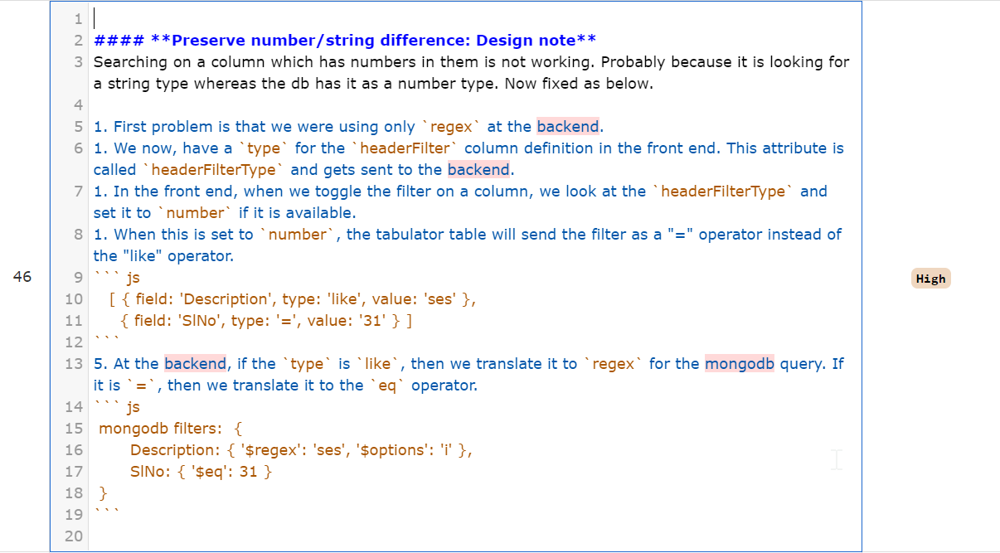
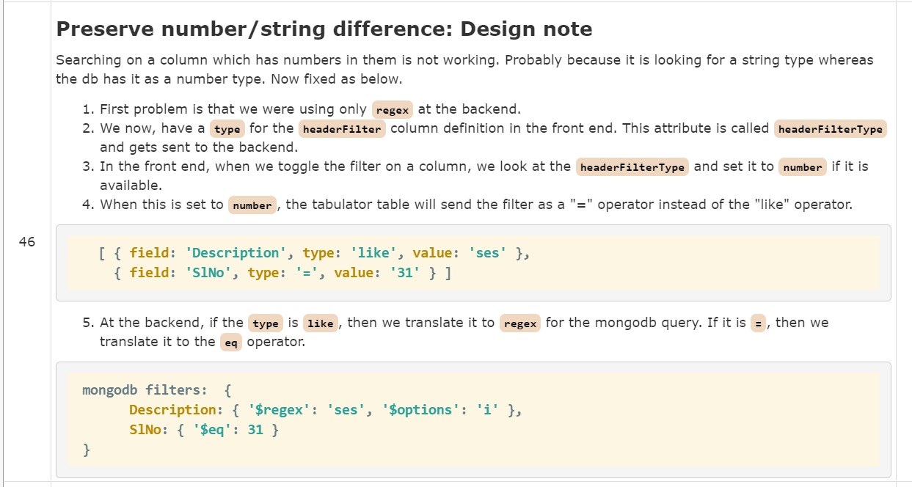
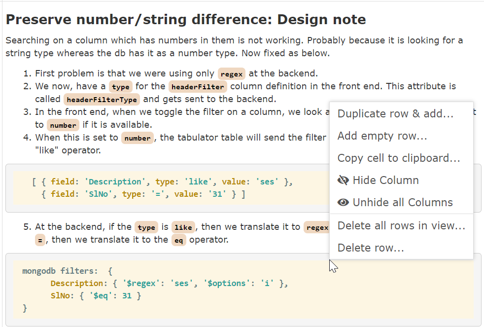
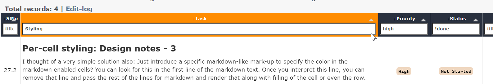
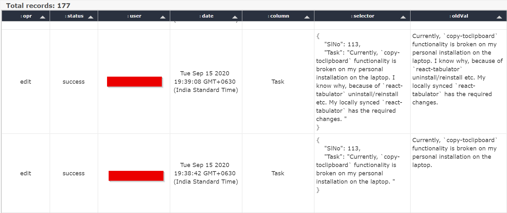

# Datagroom `v0.5`

Datagroom aims to provide tools to maintain and groom arbitrary datasets with a simple and intuitive user-experience. The data grooming can be done by multiple users simultaneously. 

* [datagroom-gateway](https://github.com/h-tendy/datagroom-gateway): This constitutes the backend of datagroom. 

* [datagroom-ui](https://github.com/h-tendy/datagroom-ui): Constitutes the react front-end for it. 

## Features

1. The data is stored in `MongoDb` at the backend. 

1. The front-end features the wonderful `Tabulator` (tabulator.info) component. 

1. Shared editing of data with similar user-experience like a Google sheet. 
    * Per-cell locking.
    * Dynamic updates to edited cells. 
    * Guaranteed to not overwrite a more recent edit by someone else. 

1. Supports markdown in cells. You edit markdown and the html is rendered in the table. Use of `codemirror` as an editor for markdown is enabled. 

1. Export of all data to `xlsx` file format. 

1. Paging, Filtering, Searching (regex), Sorting of data. All from the backend, enabling the tool to work with very large datasets. 

1. Import your data from `xlsx` and `csv` formats. 

1. Adjust and set views that is visible for everyone. 

1. Easy copy of rendered HTML to clipboard. 

1. Configurable single or multiple selection of preset items on a column. 

1. Configurable conditional values for a column based on other column values. 

1. Right-click menu for useful tools. 

1. Per-column editable controls. Also allows you to hide some columns. Set a few formatting attribute on a per column basis. 

1. Edit-log for every single edit by any user. No danger of losing data. 

1. Hook it up to your company's active-directory for user authentication. Or use a single guest user account to start. 

## Filters

1. Click on `Show filters` checkbox to see additional controls for filtering. With these controls, you can save various column filters (with regex support), column visibility and column widths as well. 

    

1. Select from the stored filters to immediately reset the view to the stored value. The URL also changes and is directly routable. 

    

## Bulk editing

Bulk editing features are now available. Yet to be documented

## Installation on VM/Machine

1. Install `MongoDb` community edition, if you want local installation. In case of cloud `MongoDb` installation. Follow the following steps:-
    * Make a new `project` and a new empty `cluster` inside that project on mongodb atlas.
    * For the newly connected `cluster`. Click on `connect -> connect your application` and copy the url. Sample url:- mongodb+srv://<username>:<password>@<clusterName>.onvfm2f.mongodb.net/?retryWrites=true&w=majority
    * Now go to `database access` option and add new user with the same username which will be used for login to datagroom. (In case of ldap server, it will be org username. For others, create a `guest` user.). Give the user `readWriteAnyDatabase` permission.
    * Now go to `network access` option and add the ip address of the server where datagroom-gateway will run. Or, otherwise allow access from anywhere.

1. git clone the `datagroom-gateway` and `datagroom-ui` repos. If all of the repos and the mongodb installation is on the same machine, go to next step. Otherwise, in `datagroom-gateway`, add one .env file and update it with key `DATABASE` and value as the the mongodb server url. Alternatively, you can tweak `this.url` in `dbAbstraction.js` directly if url doesn't consist any sensitive information.

1. Build react-ui by doing `cd datagroom-ui; npm run build`. Note that `datagroom-gateway` and `datagroom-ui` should be at the same level because `datagroom-gateway` serves the files built in `datagroom-ui`. 

1. Start server: `cd datagroom-gateway; node ./server.js disableAD=true`. Login as `guest` with `guest` as password. If you want active-directory integration, update the configuration in `ldapSettings.js`. (`node ./server.js` if you have updated `ldapSettings.js`) If you want to use the JIRA plug-in, update the configuration in `jiraSettings.js`. 

1. Open a browser and navigate to `localhost:8887` 

## Docker installation

**Pre-requisites** - 
* Make sure that the Docker is installed on your machine.
* Make sure that both the gateway and UI code is cloned on the same directory level.

### Docker installation for deployment

**Steps to follow** :-
1. For persistence of mongodb data onto the host - Run `docker volume create dg-data`. **Note- You can skip this step if you want full cleanup of the data if the docker container stops**

1. Run the command `docker build -t dg-image -f datagroom-gateway/Dockerfile .` from the parent directory of datagroom-gateway.

1. After the image is created. Just run the command `docker run -dit -p 8887:8887/tcp -p 8887:8887/udp -p 443:443/tcp -p 443:443/udp -v dg-data:/var/lib/mongodb --name dg-container dg-image`. **Note - If you have skipped the first step of docker volume creation, you can omit the `-v dg-data:/var/lib/mongodb` in the above command.**

1. You can now go to the browser on the link `http://<host-ip>:8887` and see the webapp running.

1. To see the processes running - you can attach to the `dg-container` image.

### Docker installation for development

**Steps to follow** :-
1. For persistence of mongodb data onto the host - Run `docker volume create dg-data`.

1. Run the command `docker build -t dg-image -f datagroom-gateway/Dockerfile .` from the parent directory of datagroom-gateway.

1. After the image is created. Just run the command `docker run -dit -p 8887:8887/tcp -p 8887:8887/udp -p 443:443/tcp -p 443:447/udp -v /home/${USER}:/home/${USER} -v dg-data:/var/lib/mongodb --name dg-container dg-image devMode=ON absolutePathToServerFile=<absolute path to the /datagroom-gateway/server.js file>`. <br/> Example command: - `docker run -dit -p 8887:8887/tcp -p 8887:8887/udp -p 443:443/tcp -p 443:447/udp -v /home/${USER}:/home/${USER} -v dg-data:/var/lib/mongodb --name dg-container dg-image devMode=ON absolutePathToServerFile=/home/abc_user/DG-development/datagroom-gateway/server.js`. <br/> **Note - Here, you can mount any source and target directory while development. By default it is mounting the /home/$USER. You can change this behaviour as you prefer by altering the argument to `-v`. Make sure that the absolute path to the server file is mounted correctly. If the path is invalid or not mounted correctly, it can lead to unexpected behaviour.** (absolutePathToServerFile is necessary to indicate that out of the mounted directory, in which path you are going to develop so that the docker container picks the correct path and run the intended server.js file)

1. You can now go to the browser on the link `http://<host-ip>:8887` and see the webapp running.

1. You can attach to the container and make the changes in backend code on the host.


## Uses

1. For quick bug lists, scrum todo lists, personal lists, code notes etc. 

1. Light enough for personal use on a single computer. 

1. Any table-like data that can be shared/edited. 

## Screenshots

1. A sample table once populated:


1. Markdown editing in progress



1. Markdown rendered once editing is done


1. Right-click menu


1. Filters in action


1. Edit-log


## Starting DataGroom stack (Production)

The recommended way to start the DataGroom stack in a production environment is to use the `startDg.sh` script provided in the repository.

### How to Start

Run the following command from your project directory:

```bash
nohup ./startDg.sh &
```

### Files Generated
- **nohupGateway.log**: Captures all output from the DataGroom server and the script itself, including crash/restart messages and system resource snapshots (from the `top` command) when the server restarts.
- **datagroom.log**: The main application log file. On every crash/restart, this file is rotated and renamed to `datagroom.log.<PID>.<timestamp>`, preserving logs for each run.
- **top snapshots (in nohupGateway.log)**: After every crash, the script logs 5 consecutive `top` command outputs (1 second apart) to help diagnose resource issues.

### Script Advantages
- **Automatic Restart**: If the DataGroom server crashes, the script waits 10 seconds and restarts it automatically.
- **Log Backup**: Preserves old logs by renaming `datagroom.log` on every crash, preventing log loss.
- **Resource Diagnostics**: Captures system resource usage (`top` output) at the time of failure for easier troubleshooting.
- **Graceful Cleanup**: If the script is stopped, it ensures the server process is also terminated, preventing orphaned processes.

This approach ensures high reliability and easier maintenance for production deployments.


